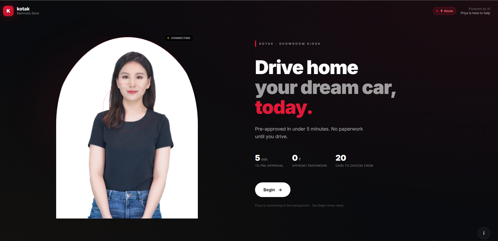
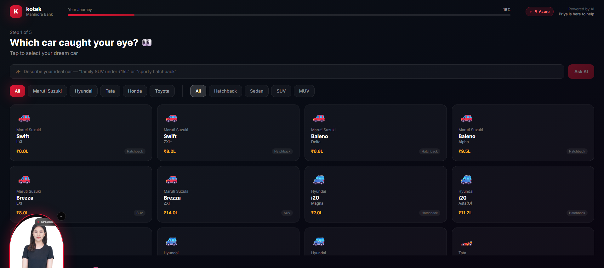
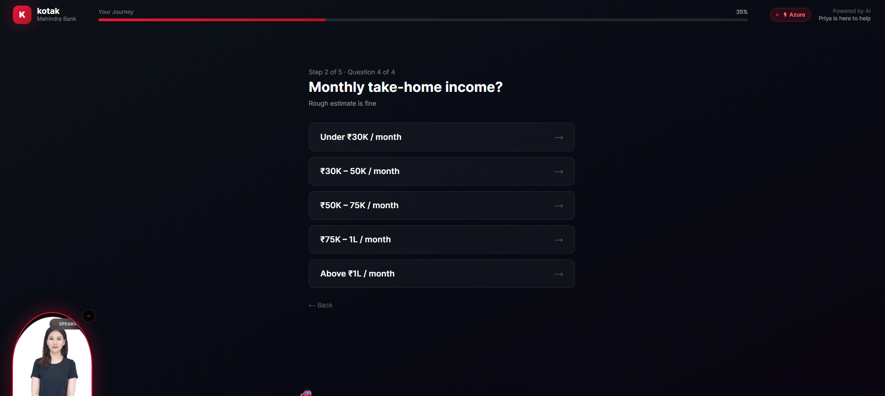
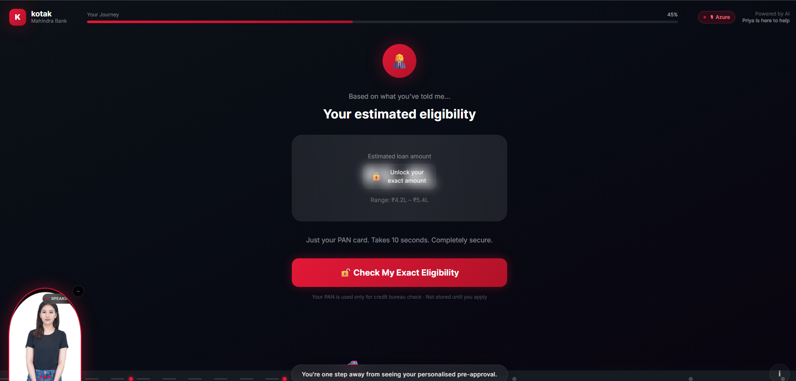
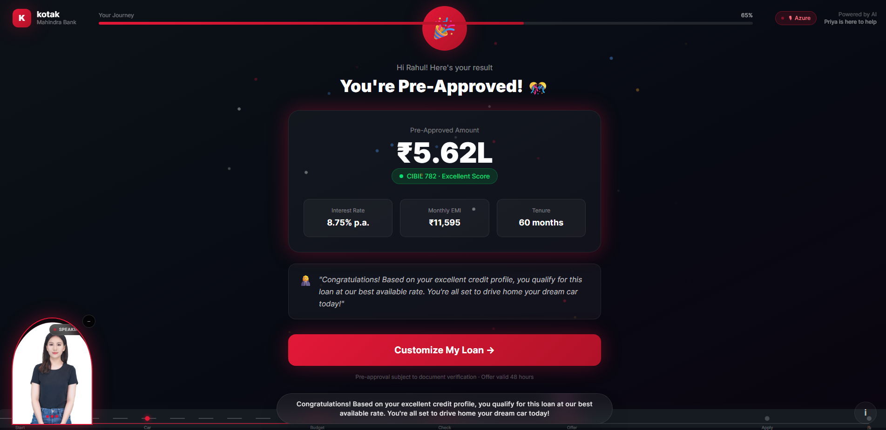
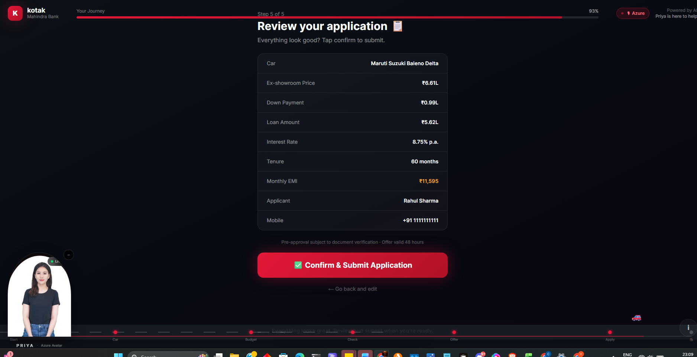
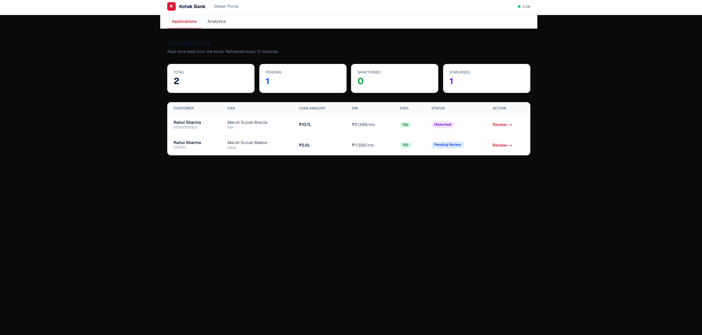
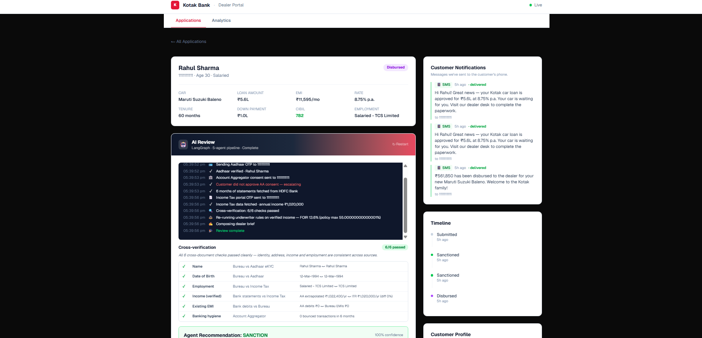

<div align="center">

# Car Loan Kiosk · Gamified Showroom Journey

**Walk into a showroom → drive out with a car in 25 minutes.**

An end-to-end agentic AI system for a showroom car-loan journey.
A customer talks to a real-time Azure AI avatar named Priya, picks a car,
answers four slider-based questions, gets a pre-approval, and walks to the
dealer desk — where a LangGraph-orchestrated agent handles digital document
verification with OTP human-in-loop and recommends a one-click sanction.

<br/>

### 🚀 Try it live

| Role | Try it | What you'll see |
|---|---|---|
| **Customer** | **[→ ai-loan-kiosk.vercel.app](https://ai-loan-kiosk.vercel.app/)** | Priya live, full 7-stage journey with WebRTC avatar |
| **Dealer** | **[→ ai-loan-dealer.vercel.app](https://ai-loan-dealer.vercel.app/)** | Applications queue + Analytics funnel + LangGraph review |
| **API docs** | **[→ car-loan-kiosk.onrender.com/docs](https://car-loan-kiosk.onrender.com/docs)** | FastAPI auto-generated Swagger |

> First request to the backend may take ~30s (Render free tier cold start).
> Demo PAN starts with **A / B / C / D / E** → different personas & outcomes.
> Demo OTP in the AI Review panel is **`123456`**.


</div>

---

## What this actually is

A three-part system demonstrating where AI genuinely belongs in a loan flow
— and where it doesn't. Nothing marketing-flavoured:

- **Money decisions (eligibility, rate, FOIR)** → deterministic rules, auditable, RBI-defensible
- **Natural-language rendering (greetings, briefs, narratives)** → LLM calls
- **Multi-step coordination (document verification with OTP pauses)** → LangGraph agentic workflow
- **Customer face (avatar)** → Azure Real-Time TTS Avatar streaming over WebRTC

The split is the point. A regulator can inspect the rules. An engineer can
read the agent graph. A customer sees Priya.

## Screenshots — the full flow, end to end

Follow the numbered path below to see how a walk-in customer goes from
*"which car caught your eye?"* all the way to a dealer-side LangGraph agent
sanctioning the loan. Each shot maps to a stage in the architecture diagram
further down.

### 🧍 Customer kiosk — stages 0 → 6

**1 · Idle / Welcome (Stage 0)** — Priya's Azure WebRTC avatar auto-connects on page load. First tap on *Begin* unlocks audio and she greets the customer by voice.

<div align="center">
  
</div>

**2 · Car catalog (Stage 1)** — filter 20 cars across 5 brands and body types. Rules engine handles the JSON query; Priya's corner widget reacts in the bottom-left.

<div align="center">
  
</div>

**3 · Financial discovery (Stage 2)** — four slider-style questions: down payment, tenure, employment type, monthly take-home income. Live EMI preview is computed by the rules engine.

<div align="center">
  
</div>

**4 · Eligibility teaser (Stage 3 · pre-PAN)** — *"Your estimated eligibility"* is shown blurred. This is the hook that makes the customer enter their PAN to unblur the exact number.

<div align="center">
  
</div>

**5 · Pre-approval reveal (Stage 3 · post-bureau)** — PAN runs through mock bureau → rules engine computes exact amount, rate, tenure and EMI → LLM writes Priya's congratulations message on top of the structured result.

<div align="center">
  
</div>

**6 · Review & submit (Stage 5)** — every field surfaced one last time before submission. Tap *Confirm & Submit Application* to push the application into the dealer queue.

<div align="center">
  
</div>

---

### 🧑‍💼 Dealer portal — handoff to the LangGraph agent

**7 · Applications queue** — real-time feed from the kiosk (polls every 10s). Totals split into Pending / Sanctioned / Disbursed. Click *Review →* to open the AI Review workspace.

<div align="center">
  
</div>

**8 · AI Review (LangGraph agentic pipeline)** — the 5-agent graph runs live with an `interrupt()` pause at each OTP node. Dealer enters `123456` at Aadhaar / AA / ITR prompts; the graph resumes, cross-verifies 6 fields, re-runs the underwriter on *verified* income, and the LLM composes the final dealer brief. The green *Sanction & Notify Customer* button fires a mock SMS and auto-advances the kiosk to the celebration screen.

<div align="center">
  
</div>

---

### 🔗 How the screenshots map to the architecture

```
Screenshot 1 (Idle)           ──▶ Kiosk · Azure WebRTC Avatar session starts
Screenshot 2 (Car catalog)    ──▶ Kiosk · Rules engine (JSON query over cars.json)
Screenshot 3 (Financial Q's)  ──▶ Kiosk · Rules engine (EMI formula, live preview)
Screenshot 4 (Teaser)         ──▶ Backend · /eligibility/estimate (declared income only)
Screenshot 5 (Reveal)         ──▶ Backend · mock bureau → rules → LLM prose renderer
Screenshot 6 (Review)         ──▶ Backend · POST /application  → sessions.json
Screenshot 7 (Dealer queue)   ──▶ Dealer · GET /applications (10s poll)
Screenshot 8 (AI Review)      ──▶ Backend · LangGraph review_graph.py with interrupt()
                                            │
                                            ├─▶ Aadhaar OTP  (interrupt → resume)
                                            ├─▶ AA consent   (interrupt → resume)
                                            ├─▶ ITR OTP      (interrupt → resume)
                                            ├─▶ Cross-verify (6 rule-based checks)
                                            ├─▶ Underwrite   (rules on verified income)
                                            └─▶ Compose brief (LLM renderer)
```

## Architecture

```
┌─────────────────┐     events      ┌───────────────────────┐
│  Kiosk (3000)   │────────────────▶│                       │
│  Customer-facing│                 │                       │
│  Next.js 16     │ token + ICE     │   FastAPI Backend     │
│                 │◀────────────────│   (8000)              │
│                 │                 │                       │
│  ┌───────────┐  │    WebRTC       │   ▪ sessions.json     │
│  │  Azure    │  │  video+audio    │   ▪ applications[]    │
│  │  Speech   │◀─┼─────────────────┼─▶ ▪ analytics/*       │
│  │  SDK      │  │  peer-to-peer   │   ▪ LangGraph review  │
│  └───────────┘  │  (lip-synced)   │   ▪ mock India Stack  │
└─────────────────┘                 │                       │
                                    │   Azure Speech API    │
┌─────────────────┐     polls       │   OpenAI GPT-4o       │
│ Dealer (3001)   │◀───────────────▶│   Groq LLM (optional) │
│ Applications +  │   10s poll      │                       │
│ Analytics tabs  │                 └───────────────────────┘
└─────────────────┘
```

Three apps, one backend. Each app owns its concern, shares nothing but the API.

## 🧭 How to walk the full demo (customer + dealer, end-to-end)

Open both links side-by-side. ~90 seconds total.

### 1. On the **[kiosk](https://ai-loan-kiosk.vercel.app/)** (customer screen)

1. **Wait 3–5 seconds** — Lisa's WebRTC avatar auto-connects. You'll see her pulse-ring "connecting" indicator, then she appears nodding. No action needed.
2. **Tap "Begin"** — she speaks the greeting (first tap unlocks audio, browser rule). She speaks, then auto-advances.
3. **Pick a car** — filter by brand, tap any card. Priya corner-widget reacts in bottom-left.
4. **Answer 4 sliders** — down payment, tenure, employment, income range. Live EMI preview.
5. **See the teaser** — *"Your eligibility: ₹ █████"* blurred. Hook to PAN entry.
6. **Enter PAN** — use `ABCPE1234A` (prefix A → Rahul Sharma, strong approval). Backend runs mock bureau → rules engine → LLM writes Priya's result message.
7. **Eligibility reveal** — 🎉 amount, rate, EMI, CIBIL 742. Priya congratulates in natural language.
8. **Adjust EMI** — three sliders; numbers update live.
9. **Enter phone** — any 10 digits. Review screen shows everything.
10. **Submit** → you land on the Waiting screen. Polls dealer status every 3s.

### 2. On the **[dealer portal](https://ai-loan-dealer.vercel.app/)** — process the application

1. **Applications tab** (the default page) → your new submission appears at the top within 10 seconds.
2. **Click "Review →"** on the row → opens the application detail page.
3. **(Optional) Click "Generate Brief"** → LLM writes a 2-line customer approach guide in ~1s.
4. **Click "▶ Start AI Review"** inside the AI Review panel (dark header).
   A terminal-style log appears and the LangGraph graph runs live:
   - 🪪 Aadhaar OTP request → **enter `123456`** → Aadhaar eKYC data fetched
   - 🏦 Account Aggregator consent → **enter `123456`** → 6 months of bank statements
   - 📄 ITR portal OTP → **enter `123456`** → Form 26AS / income data
   - 🔍 Cross-verification (6 checks) — name, DOB, employment, income, existing EMI, banking hygiene
   - ⚖️ Underwriter re-runs FOIR on **verified** income
   - ✍️ LLM composes the final dealer brief
5. **Recommendation card appears** — `SANCTION` in green with confidence % + the prose brief.
6. **Click "✓ Sanction & Notify Customer"** — the big green button.
   - Application status flips to `Sanctioned`
   - Right sidebar "Customer Notifications" shows the mock SMS sent to the customer's phone
   - **Back on the kiosk** → the waiting screen auto-advances to the celebration screen within 3 seconds
7. **Click "Disburse Amount"** — second mock SMS logged, status → `Disbursed`.

### 3. On the **Analytics tab** — see the journey data

Same dealer portal, top-right nav: **Analytics**.

- **5 stat cards** — Total sessions / Active now / Completed / Dropped / Conversion rate
- **AI Insights** panel — narrative bullets over the funnel
- **Funnel chart** — all 11 stages, bar per stage with % reaching it
- **Drop-off hotspot** — highlights which stage loses the most customers
- **Popular cars** — top 5 picks
- **Recent Sessions** table — every kiosk visitor (yes, including drop-offs). Click any row → **full event timeline** with readable rows (not raw JSON): car picked, financial answers, PAN masked, bureau profile, loan config, phone, application ID.

> Try the different PAN prefixes to see how the system behaves:
> **A** (Rahul, CIBIL 782) → strong approval · **C** (Vikram, CIBIL 668) → partial approval · **E** (Rajan, CIBIL 584) → soft decline with phone captured for follow-up.

---

## The customer journey — 7 stages

| # | Stage | What happens | What runs |
|:-:|---|---|---|
| 0 | Idle / Attract | WebRTC avatar auto-connects on page load. First tap unlocks audio → Priya greets. | Azure Avatar (WebRTC) |
| 1 | Car Catalog | Filter 20 cars by brand + segment. Tap to pick. | Rules (JSON query) |
| 2 | Financial Discovery | 4 slider questions: down payment, tenure, employment, income range. Live EMI preview. | Rules (EMI formula) |
| 3 | PAN + Bureau | Customer enters PAN → mock bureau returns profile → rules engine computes eligibility → LLM writes Priya's result message | Mock bureau → rules → LLM renderer |
| 4 | EMI Optimizer | Three sliders adjust amount/tenure/down payment with live EMI update. | Rules (EMI math) |
| 5 | Phone + Review | Phone capture, review card, submit. | Form validation |
| 6 | Waiting | Kiosk polls application status every 3s. Auto-advances the instant the dealer sanctions. | WebSocket-ready polling |
| 7 | Celebration | Confetti, *"Your car is waiting for you"*, SMS notification acknowledgement. | Rules |

## Where AI sits — honest breakdown

| Feature | Technology | Why this choice |
|---|---|---|
| Priya's face + voice | **Azure Real-Time TTS Avatar** (WebRTC, lip-synced) | Real-time, multi-region, enterprise-grade |
| Stage-3 result message | **LLM (OpenAI / Groq)** | Personalized prose from structured rule-engine output |
| Dealer brief | **LLM renderer** | Turns 12 structured fields into 3 natural-language lines |
| Follow-up drop-off agent | **LLM + tools** | Multi-step reasoning: timing + channel + tone + message body |
| Agentic document review | **LangGraph 1.x** | 5-node graph with `interrupt()` for OTP pauses |
| Eligibility decision | **Rules engine** | Deterministic, auditable, RBI-safe |
| FOIR / LTV / rate lookup | **Rules** | Money decisions never leave the rules layer |
| Document cross-verification | **Python comparison** | Field matching is rules, not intelligence |
| Session tracking | **JSON file** (swap for Postgres in prod) | Every kiosk visitor logged, including drop-offs |

**Principle: the LLM never makes credit decisions. It only explains
decisions that rules already made.**

## The agentic review (LangGraph deep-dive)

When the dealer clicks **Start AI Review** on an application, this graph runs:

```
         START
           │
         init  ──▶ request_aadhaar_otp ⏸   (interrupt — waits for dealer-entered OTP)
                          │
                   fetch_aadhaar (mock)
                          │
                    request_aa_consent ⏸   (interrupt — consent code)
                          │
                    fetch_aa (mock)
                          │
                    request_itr_otp ⏸      (interrupt — IT portal OTP)
                          │
                    fetch_itr (mock)
                          │
                         verify
                    ┌─────┴─────┐
                    │           │
              [2+ flags]     [passes]
                    │           │
              flagged_end   underwrite   ← re-runs FOIR on VERIFIED income
                    │           │        (rules engine, authoritative)
                    │           │
                    └──▶ compose_brief  ← LLM writes 3-line dealer summary
                              │
                            END
```

Key properties:

- **Human-in-loop via `langgraph.types.interrupt()`** — the graph pauses at each OTP node until the dealer POSTs the code; state is persisted in `InMemorySaver` so the pause survives across HTTP calls
- **Conditional edges** — 2+ verification flags route to `flagged_end`; otherwise to `underwrite`
- **LLM is the renderer, not the underwriter** — the re-check uses the same rules engine that Stage 3 did, just fed verified income from the AA data rather than the customer's declared income

For the demo OTP is hardcoded (`123456`) — swap in real UIDAI / Sahamati / IT portal integrations to ship.

## Tech stack

| Layer | Choice | Why |
|---|---|---|
| Kiosk + Dealer frontend | Next.js 16 (App Router) + Tailwind + Framer Motion + Zustand | Fast, SSR-ready, great for touchscreens |
| Backend | Python 3.11 + FastAPI | Async, type-hinted, best-in-class for AI glue |
| Agentic orchestration | LangGraph 1.1.9 with `InMemorySaver` | Native interrupt/resume, conditional edges, graph visualisation |
| Avatar | Azure Real-Time TTS Avatar (`lisa-casual-sitting`) | Sub-second lip-sync via WebRTC |
| Voice | Azure Neural TTS (`en-IN-NeerjaNeural`) | Indian English female, free-tier friendly |
| LLM | OpenAI GPT-4o (with graceful template fallback if no key) | Best prose quality; templates keep demo alive without keys |
| Mock India Stack | JSON files (`bureau_profiles.json`, `demo_documents.json`) | One master file per citizen keeps Aadhaar / AA / ITR consistent |
| Session store | `sessions.json` on disk | Demo-simple; swap for Postgres in prod with zero code change |
| Deployment | Render (backend) + Vercel (two frontends) | Both free tier, GitHub-connected auto-deploy on `git push` |

## Demo personas

PAN prefix triggers a persona — the whole journey is deterministic based on
the first letter:

| PAN prefix | Persona | CIBIL | Outcome |
|:-:|---|:-:|---|
| **A** | Rahul Sharma · Salaried at TCS | 782 | Strong approval, best rate |
| **B** | Priya Mehta · Salaried at Infosys BPM | 724 | Standard approval |
| **C** | Vikram Patel · Self-employed retail | 668 | Partial approval |
| **D** | Sneha Gupta · Salaried small firm, 2 missed payments | 638 | Reduced offer, CIBIL hidden |
| **E** | Rajan Kumar · Self-employed, 5 missed, defaults | 584 | Soft decline, phone captured for follow-up |

**Demo OTP:** `123456` — works for all OTP prompts in the AI Review panel.

## Three example flows — same architecture, three branches

Pick one of three PAN prefixes. The same code runs for all three; the rules
engine takes a different branch and the LLM retrieves a different set of KB
chunks. The three cases below cover full approval, partial approval (FOIR
breach), and soft decline.

### Case 1 — Rahul Sharma · Full approval

| | |
|---|---|
| **PAN** | `ABCPE1234A` |
| **Profile** | Salaried, TCS Limited |
| **CIBIL** | 782 (Excellent) |
| **Verified income** | ₹85,000/month |
| **Existing EMI** | ₹0 |
| **Picks** | Maruti Suzuki Baleno · ₹8.5L |
| **Down payment** | ₹1.0L · Loan ₹7.5L · 60 months |

```
┌─────────────────────────────────────────────────────────────────┐
│                       CUSTOMER KIOSK                            │
└─────────────────────────────────────────────────────────────────┘

 [Stage 0]   Idle / Welcome
            │ (Azure WebRTC avatar)
            ▼
 [Stage 1]   Pick car: Maruti Baleno Delta
            │ (Rules query over cars.json)
            ▼
 [Stage 2]   Sliders → ₹1L down, 60mo, salaried, ₹75K–1L
            │ (Rules: live EMI preview)
            ▼
 [Stage 3]   Enter PAN  →  Mock Bureau pull
            │   ┌─ Rules engine computes:
            │   │   • Eligible: ₹7.5L
            │   │   • Rate: 8.50% p.a.   (KB: rate_card.md, "780+ Excellent salaried")
            │   │   • EMI: ₹15,386
            │   │   • FOIR: 18.1% (vs 60% cap)
            │   └─ ✅ SANCTION pre-approved
            │
            │  ┌──────────────────────────────────────────┐
            │  │ 🤖 LLM CALL #1 — Stage-3 message         │
            │  │ Provider: OpenRouter → Grok 4.1 Fast      │
            │  │ KB retrieved: rate_card, foir_caps        │
            │  │ Output: "🎉 Pre-approved at our best      │
            │  │   salaried rate of 8.50% — ₹7.5L for     │
            │  │   your Baleno..."                         │
            │  └──────────────────────────────────────────┘
            ▼
 [Stage 4-5] EMI optimizer → Phone → Review → Submit
            ▼
 [Stage 6]   Waiting (poll dealer)


┌─────────────────────────────────────────────────────────────────┐
│                       DEALER PORTAL                             │
└─────────────────────────────────────────────────────────────────┘

 Application appears in queue  →  Click "Start AI Review"
            │
            ▼
 LangGraph runs: init → request_aadhaar 🛑(123456) → fetch_aadhaar
                      → request_aa 🛑(123456) → fetch_aa
                      → request_itr 🛑(123456) → fetch_itr → verify
                              │
                              ▼  6/6 checks pass, 0 flags
            ┌──────────────────────────────────────────┐
            │ 🤖 LLM CALL #2 — Verification narrative   │
            │ KB retrieved: risk/soft_flag_thresholds   │
            │ Output: "All 6 checks passed cleanly.     │
            │   Identity, income, employment consistent"│
            └──────────────────────────────────────────┘
                              ▼
                    underwrite (FOIR 18.1% ✓)
                              ▼
            ┌──────────────────────────────────────────┐
            │ 🤖 LLM CALL #3 — Structured DealerBrief   │
            │ KB retrieved:                             │
            │   • policy/foir_caps                      │
            │   • policy/rate_card                      │
            │   • cross_sell/salaried_high_income       │
            │ Output (excerpt):                         │
            │   risk_level: LOW · confidence: 100%      │
            │   summary: "₹85K/mo TCS, FOIR 18% << 60%" │
            │   positives: 8.50% rate, zero EMI...      │
            │   cross_sell_hint: "Pre-approved PL up    │
            │     to 3× monthly income at preferential" │
            └──────────────────────────────────────────┘
                              ▼
              Sanction → SMS → Customer celebrates
```

### Case 2 — Vikram Patel · Partial approval after FOIR breach

| | |
|---|---|
| **PAN** | `CVKPE5678C` |
| **Profile** | Self-employed retail business |
| **CIBIL** | 668 (Below average) |
| **Verified income** | ₹55,000/month |
| **Existing EMI** | ₹14,000 (₹9.5K + ₹4.5K) |
| **Picks** | Maruti Brezza · ₹14L |
| **Asked** | ₹8.5L loan, 60 months |

**Calculations triggered**
- Self-employed sub-700 → rate ~11.75% (KB: `rate_card.md`)
- Asked-EMI: ~₹18,800
- Asked-FOIR: (18,800 + 14,000) / 55,000 = **59.6%**
- Policy cap for ₹30–75K income, CIBIL 650–699: **45%**
- ❌ Exceeds cap → **partial approval**, not full

```
[Stage 3] PAN → Bureau (CIBIL 668)
              │
              ▼ Rules engine:
              •  Asked: ₹8.5L → FOIR 59.6% > 45% cap
              •  Backsolve: max affordable EMI = ₹10,750
              •  Reduced loan: ~₹4.85L at 11.75%/60mo
              │
              ▼
 ┌──────────────────────────────────────────────────────┐
 │ 🤖 LLM CALL — Stage-3 message                         │
 │ KB retrieved:                                         │
 │   • policy/foir_caps     (45% cap for this band)      │
 │   • policy/rate_card     (11.75% self-employed)       │
 │   • faq/low_cibil        (improvement guidance)       │
 │ Output: "Vikram, we can pre-approve ₹4.85L at         │
 │  11.75% — your existing ₹14K EMI puts ₹8.5L outside   │
 │  policy. Tip: increase down payment by ₹40K to drop   │
 │  FOIR to 38%; that unlocks the 11% rate band."        │
 └──────────────────────────────────────────────────────┘

[Dealer side] — Same LangGraph review runs to completion

 verify → 6/6 checks pass (no fraud flags)
       → underwrite re-confirms FOIR breach with verified income
       → compose_brief

 ┌──────────────────────────────────────────────────────┐
 │ 🤖 STRUCTURED DEALER BRIEF                            │
 │ KB retrieved:                                         │
 │   • policy/foir_caps                                  │
 │   • policy/rate_card                                  │
 │   • cross_sell/self_employed_business                 │
 │   • risk/soft_flag_thresholds                         │
 │                                                       │
 │ risk_level: MEDIUM · confidence: 75%                  │
 │ summary: "Vikram operates a retail business with      │
 │   ₹55K verified income. CIBIL 668 places him in       │
 │   sub-prime band with 45% FOIR cap; asked-loan        │
 │   pushes FOIR to 59.6%. Recommend reduced sanction    │
 │   at ₹4.85L."                                         │
 │ key_positives:                                        │
 │   • Business vintage 7 yrs · stable cash flow         │
 │   • Verified income matches AA + ITR within 8%        │
 │ key_concerns:                                         │
 │   • FOIR breach at requested loan size                │
 │   • 1 missed payment in 12 months · 4 inquiries       │
 │ talking_points:                                       │
 │   • Suggest higher down payment to keep target loan   │
 │   • OR offer ₹4.85L at 11.75% with full sanction      │
 │ cross_sell_hint: "Working capital OD against current  │
 │   account — same docs, no fresh underwriting."        │
 └──────────────────────────────────────────────────────┘
```

**Side-by-side: Template vs LLM**

```
 ┌───────────────────────────────────────────────────┐
 │ 📄 TEMPLATE                                       │
 │ "Vikram is a self-employed professional, with     │
 │  verified monthly income of ₹55,000. They have    │
 │  ₹14,000 existing EMI and their average credit    │
 │  profile leaves FOIR at 59.6% — well within       │
 │  the 45% policy cap. Recommendation: SANCTION."   │
 │                                                   │
 │  ❌ Says "well within" when 59.6 > 45             │
 │  ❌ Recommends SANCTION when rules say partial    │
 │  ❌ No actionable suggestion                      │
 │  ❌ No cross-sell                                 │
 │  ❌ No risk tier                                  │
 └───────────────────────────────────────────────────┘
                       vs
 ┌───────────────────────────────────────────────────┐
 │ 🤖 LLM + RAG                                      │
 │  ✅ Catches the FOIR breach                       │
 │  ✅ Suggests +₹40K down payment OR reduced loan   │
 │  ✅ Cites 45% cap from foir_caps.md               │
 │  ✅ Cites 11.75% rate from rate_card.md           │
 │  ✅ Cross-sell from self_employed_business.md     │
 │  ✅ MEDIUM risk badge, 75% confidence             │
 └───────────────────────────────────────────────────┘
```

### Case 3 — Rajan Kumar · Soft decline + lead capture

| | |
|---|---|
| **PAN** | `ERAKE9999E` |
| **Profile** | Self-employed, no business proof |
| **CIBIL** | 584 (High risk) |
| **Verified income** | ₹35,000/month |
| **Existing EMI** | ₹26,000 (₹12K + ₹8K + ₹6K) |
| **Missed payments** | 5 in last 12 months |

**Calculations**
- CIBIL < 650 → auto-decline threshold (KB: `escalation_rules.md`)
- Existing FOIR already 74% (₹26K / ₹35K) → no headroom for new EMI
- 5 missed payments → multiple soft flags trip
- 8 inquiries in 6 months → distress signal

```
[Stage 3] PAN → Bureau (CIBIL 584)
              │
              ▼ Rules engine:
              •  CIBIL below 650 — auto-decline threshold
              •  FOIR already 74% before new EMI
              │
              ▼
 ┌──────────────────────────────────────────────────────┐
 │ 🤖 LLM CALL — Empathetic decline message              │
 │ KB retrieved:                                         │
 │   • faq/low_cibil           (improvement steps)       │
 │   • faq/rejection_reasons   (transparency)            │
 │   • cross_sell/low_band_recovery (rebuild path)       │
 │ Output: "Rajan, we couldn't pre-approve at this       │
 │  time — your existing EMIs leave little room for      │
 │  another. Three things that would help: clear the     │
 │  smallest credit balance, avoid new applications      │
 │  for 90 days, and revisit in 4 months. We'll save     │
 │  your details and reach out."                         │
 └──────────────────────────────────────────────────────┘
              │
              ▼
 [Stage]    Phone capture only (NO loan submission)
              │
              ▼
 ┌──────────────────────────────────────────────────────┐
 │ 🤖 Drop-off recovery agent (Phase 3)                  │
 │ Scheduled via APScheduler: SMS in 30 days             │
 │ "Hi Rajan, 30 days since your visit. Want a quick     │
 │  check on whether your profile has improved? Reply    │
 │  YES."                                                │
 └──────────────────────────────────────────────────────┘

[Dealer side] — never reaches the dealer queue (auto-declined)
              Lead enters the soft-decline funnel for
              cross-sell of secured-credit-card products.
```

### Comparison summary

| | Rahul (A) | Vikram (C) | Rajan (E) |
|---|---|---|---|
| **CIBIL** | 782 ✅ | 668 ⚠️ | 584 ❌ |
| **Outcome** | Full sanction | Reduced sanction | Soft decline |
| **Decision by** | Rules engine | Rules engine | Rules engine |
| **LLM role** | Renders + cross-sells | Renders + suggests action | Renders empathy |
| **KB chunks hit** | rate_card, foir_caps, salaried_high_income | foir_caps, rate_card, self_employed_business, soft_flag_thresholds | low_cibil, rejection_reasons, low_band_recovery |
| **Risk level** | LOW | MEDIUM | HIGH (auto-decline) |
| **Goes to dealer** | Yes | Yes | No (lead funnel) |

## Run locally

Three terminals.

### 1. Backend
```bash
cd backend
python -m venv venv
source venv/Scripts/activate    # Windows Git Bash
pip install -r requirements.txt
cp .env.example .env             # fill Azure / OpenAI / ElevenLabs keys
uvicorn main:app --reload --port 8000
```

### 2. Kiosk
```bash
cd kiosk
npm install
echo "NEXT_PUBLIC_API_URL=http://localhost:8000" > .env.local
npm run dev                      # http://localhost:3000
```

### 3. Dealer Portal
```bash
cd dealer-portal
npm install
echo "NEXT_PUBLIC_API_URL=http://localhost:8000" > .env.local
npm run dev -- -p 3001           # http://localhost:3001
```

## Deploy (free)

### Backend → Render
1. [dashboard.render.com](https://dashboard.render.com) → **New Web Service** → connect this repo
2. Root Directory: `backend` · Build: `pip install -r requirements.txt` · Start: `uvicorn main:app --host 0.0.0.0 --port $PORT`
3. Env vars: `PYTHON_VERSION=3.11.9`, `TTS_PROVIDER=azure`, `AZURE_SPEECH_KEY`, `AZURE_SPEECH_REGION=centralindia`, `AZURE_AVATAR_KEY`, `AZURE_AVATAR_REGION=southeastasia`
4. Deploy → copy the URL (e.g. `car-loan-kiosk.onrender.com`)

### Frontends → Vercel (two projects)
1. [vercel.com/new](https://vercel.com/new) → import this repo → **Root Directory: `kiosk`**
2. Env var: `NEXT_PUBLIC_API_URL=<your Render URL>`
3. Deploy → get your kiosk URL
4. Repeat with **Root Directory: `dealer-portal`**

Every `git push origin main` auto-redeploys all three.

## Project structure

```
car-loan-kiosk/
├── backend/
│   ├── agents/                    LLM reasoner + LangGraph review graph
│   │   ├── review_graph.py        ▸ the agentic review pipeline (6 nodes)
│   │   ├── llm_reasoner.py        ▸ single abstraction over OpenAI with template fallback
│   │   └── followup_agent.py      ▸ drop-off recovery agent (APScheduler)
│   ├── data/
│   │   ├── cars.json              20 cars, 5 brands
│   │   ├── bureau_profiles.json   5 PAN-prefix personas (A-E)
│   │   ├── demo_documents.json    Aadhaar / AA / ITR per persona
│   │   └── loan_rules.json        FOIR, LTV, rate matrix, income floors
│   ├── engines/
│   │   ├── eligibility_engine.py  ▸ the rules engine (never overridden by AI)
│   │   └── emi_calculator.py
│   ├── routers/                   bureau, eligibility, application, dealer, review, sessions, analytics, avatar, tts
│   └── main.py
│
├── kiosk/                         Customer touchscreen
│   ├── app/page.tsx               AvatarProvider wrapper + stage switch
│   ├── components/
│   │   ├── stages/                One file per journey stage
│   │   └── shared/                PriyaAvatar, RoadProgress, AppHeader, TTSToggle
│   └── lib/
│       ├── useAvatar.ts           WebRTC hook (Azure Speech SDK)
│       ├── avatarContext.tsx      Auto-starts session on page mount
│       ├── useSpeech.ts           Audio-only fallback (Neerja / browser TTS)
│       ├── useSession.ts          Every stage transition → /session/event
│       └── store.ts               Zustand kiosk state
│
├── dealer-portal/                 Dealer web app
│   ├── app/
│   │   ├── page.tsx               Applications queue (polls every 10s)
│   │   ├── applications/[id]/     Full application + AI Review panel
│   │   └── analytics/             Funnel, drop-offs, session timelines
│   └── components/
│       ├── NavTabs.tsx
│       └── AIReviewPanel.tsx      ▸ the LangGraph OTP UI
│
├── SYSTEM_DESIGN.md               Original product design doc
└── README.md                      You are here
```

## What's built · what's next

**Shipped:**
- [x] 7-stage customer kiosk with Azure Real-Time Avatar (WebRTC)
- [x] Editorial Tier-1 UI with auto-connecting WebRTC on page load
- [x] Rules-based eligibility engine (FOIR / LTV / rate matrix / min-income)
- [x] Mock India Stack — bureau, Aadhaar eKYC, Account Aggregator, ITR
- [x] Dealer portal with Applications + Analytics tabs
- [x] Full session tracking for every kiosk visitor (including drop-offs)
- [x] LangGraph agentic review with OTP interrupt/resume (6-node graph)
- [x] LLM dealer brief generator (OpenAI / Groq switchable)
- [x] Customer notifications on sanction (mock SMS logged)
- [x] One-repo monorepo deployable in 3 clicks (Render + 2× Vercel)

**Next:**
- [ ] Voice-driven kiosk (Whisper STT + GPT-4o structured output — drops slider inputs)
- [ ] Auto-sanction for clear profiles (CIBIL ≥ 750 + FOIR < 30%)
- [ ] Twilio-wired follow-up agent with real WhatsApp sending
- [ ] Custom Indian avatar (Azure Custom Avatar — video recording + approval)
- [ ] Leads table for declined customers (cross-sell funnel)

## Credits

Reference implementation of an agentic AI loan-kiosk system. Uses public
India Stack concepts (UIDAI, Account Aggregator, IT portal) — all mocked.
No real customer data anywhere in the repo.
